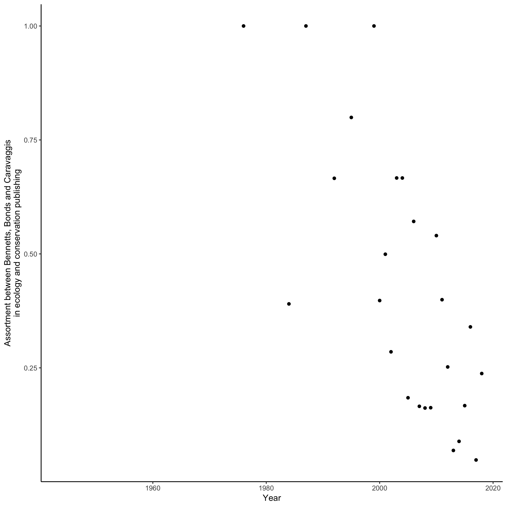

Scopus bib files were downloaded using the terms TITLE-ABS-KEY ( ecology,conservation )  AND  DOCTYPE ( ar  OR  re )  AND  ( LIMIT-TO ( SRCTYPE ,  "j" ) ), and then splitting the results by year and country as required to stay under the limit of 2,000 records per download

